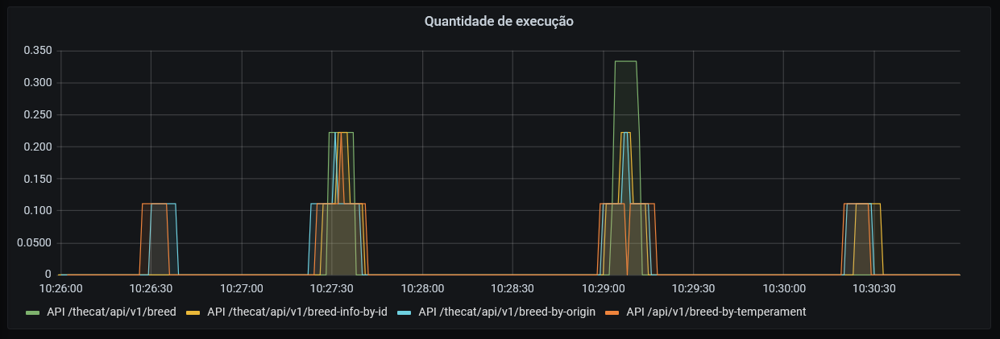
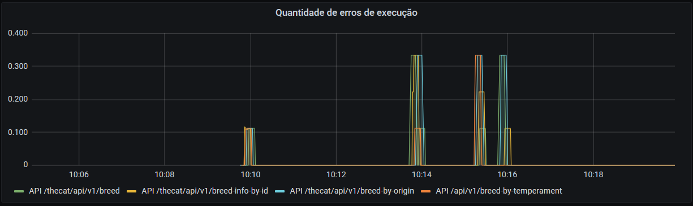
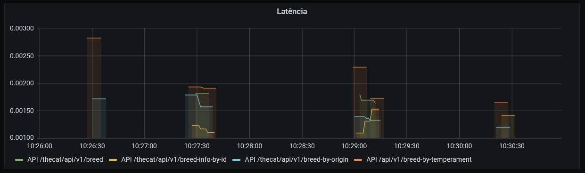

# The Cat API
Serviços de carga e disponibilização de raça, infomações e imagens de gatos.

## Índice
* [Documentação do Projeto](#Documentação-do-Projeto)
* [Dicionário de dados](#Dicionário-de-dados)
* [Documentação das APIS](#Documentação-das-APIS)
* [Documentação da Arquitetura](#Documentação-da-Arquitetura)
* [HOWTO - subida do serviço em ambiente local](#HOWTO---subida-do-serviço-em-ambiente-local)
* [Manual - Elasticsearch](#Manual---Elasticsearch)
* [Manual - Prometheus](#Manual---Prometheus)
* [Manual - Grafana](#Manual---Grafana)
* [Complementos](#Complementos)
* [Contato](#Contato)

## Documentação do Projeto
Micro serviço que coleta as informações da API de gatos (https://thecatapi.com/), realiza a carga em banco de dados (informações sobre a raça e imagens) e disponibiliza APIS de busca para consumo externo feito.
O código é feito em JAVA 11 (SpringBoot), utilizando Apache Camel, Prometheus (Micrometer), Elasticsearch, banco de dados (H2 Local) de forma que funcione como micro serviço em contêiner (Docker).
Foram criadas duas tabelas (CATS_BREEDS e CATS_IMAGES) e estas são criadas automaticamente durante a súbida da aplicação no banco de dados SQL H2 para execução local. Pode ser configurado o banco de dados conforme o ambiente (dev, hml, pro, etc).
É utilizado o Grafana para visualização das métricas obtidas via Prometheus.

## Dicionário de dados
catId       -> Id da raça do gato

name        -> Nome da raça do gato

origin      -> Origem do gato

temperament -> Temperamentos dos gato

description -> Descrição da raça do gato

## Documentação das APIS

Para a documentação das APIs, utilizamos o Swagger conforme os seguintes links:

* JSON com a estrutura dos serviços - http://localhost:8080/thecat/api/swagger/swagger.json
* Interface para execução dos serviços - http://localhost:8080/thecat/webjars/swagger-ui/index.html?url=/thecat/api/swagger&validatorUrl=

### Serviços expostos:

#### http://localhost:8080/thecat/api/v1/breed (Método GET)
Retorna uma lista com todas as raças de gatos carregados no serviço.

**Response:**
```
[
    {
        "catId": "abys",
        "name": "Abyssinian",
        "origin": "Egypt",
        "temperament": "Active, Energetic, Independent, Intelligent, Gentle",
        "description": "The Abyssinian is easy to care for, and a joy to have in your home. They’re affectionate cats and love both people and other animals."
    }
]
```

#### http://localhost:8080/thecat/api/v1/breed-info-by-id (Método GET)
Retorna a raça de um gato a partir de um parâmetro de Id.
Query param: catId
Exemplo: http://localhost:8080/thecat/api/v1/breed-info-by-id?catID=abys

**Response:**
```
{
    "catId": "abys",
    "name": "Abyssinian",
    "origin": "Egypt",
    "temperament": "Active, Energetic, Independent, Intelligent, Gentle",
    "description": "The Abyssinian is easy to care for, and a joy to have in your home. They’re affectionate cats and love both people and other animals."
}
```

#### http://localhost:8080/thecat/api/v1/breed-by-origin (Método GET)
Retorna a lista de raças de gatos a partir de um parâmetro de origem.
Query param: origin
Exemplo: http://localhost:8080/thecat/api/v1/breed-by-origin?origin=Egypt

**Response:**
```
[
    {
        "catId": "abys",
        "name": "Abyssinian",
        "origin": "Egypt",
        "temperament": "Active, Energetic, Independent, Intelligent, Gentle",
        "description": "The Abyssinian is easy to care for, and a joy to have in your home. They’re affectionate cats and love both people and other animals."
    }
]
```

#### http://localhost:8080/thecat/api/v1/breed-by-temperament(Método GET)
Retorna a lista de raças de gatos a partir de um parâmetro de temperamento.
Query param: origin
Exemplo: http://localhost:8080/thecat/api/v1/breed-by-temperament?temperament=Active

**Response:**
```
[
    {
        "catId": "abys",
        "name": "Abyssinian",
        "origin": "Egypt",
        "temperament": "Active, Energetic, Independent, Intelligent, Gentle",
        "description": "The Abyssinian is easy to care for, and a joy to have in your home. They’re affectionate cats and love both people and other animals."
    }
]
```

## Documentação da Arquitetura

### Implementação do serviço
O serviço foi implementado para que respeitasse padrões como:
- Domain Driven Design em sua estrutura no qual cada implementação consta no seu contexto correto no qual pode ser como configuração do sistema, serviços de negócio, exposição de serviços, etc.
- Test Driven Development e Behavior Driven Development durante a implementação dos testes unitários de forma que assegure o sistema e regras de negócio, mesmo que neste caso, sejam ínfimas.
- Utilização de Apache Camel para melhoria da estrutura da API de forma que utilize padrões de integração (Enterprise Integration Patterns), mesmo que neste caso, foi utilizado apenas para expor os serviços REST e executar os mesmos.
- Conceitos de SOLID para códigos mais limpos como princípio de responsabilidade única e segregação da interface.
- Utilizar fatores citados nos "Doze fatores de aplicação" como base de código rastreável com controle de revisão e deploy, isolamento de depêndencias, armazenamento de configuraçòes via variáveis de ambiente, build e deploy facilitados, etc. Muitas destas beneficas para deploy em OPENSHIFT e/ou em Cloud Públic (exemplo: Elastic Kubernetes Service).

A utilização de Prometheus para métricas e Elasticsearch para logs permite um melhor monitoramente e rastreamento do serviço (pilares da Observability). Utilizando estas ferramentas em conjunto com o Grafana, podemos reagir mais rápido a problemas e quantificar os mesmos.

Foi utilizado o banco de dados H2 para facilitar o desenvolvimento, porém é possivel conectar em diferentes bancos conforme o ambiente, apenas alterando as variáveis de conexão para o mesmo. O H2 também permite facilitar a criação de testes funcionais envolvendo banco de dados.

### Pontos de melhoria
Melhorar a atomicidade do serviço devido a possível possibilidade de escalonamento do mesmo conforme a demanda. A realização da carga do banco de dados e sua atualização se situa mais em um processo batch.
Separar a camada de API e serviço, ou seja, a API serve apenas como camada de integração (Backend for Frontend), elevando os ganhos na utilização do Apache Camel na integração com os demais serviços utilizando Apache Kafka. Os ganhos também são vistos na diminuição do acoplamento dos serviços e latência.

### Resalvas
O serviço é de baixa complexidade, sendo não necessário a utilização de muitos conceitos abordados, porém estes podem ser aplicados caso o mesmo sofra evoluções conforme o tempo.
O serviço foi modelado para um escopo mais amplo, permitindo facilitação de alteração caso necessário.

## HOWTO - subida do serviço em ambiente local

Caso utilize git, realizar o clone do projeto a partir do comando "git clone https://github.com/maurowu/thecat-api.git". Será baixado a branch default automaticamente (feature/0.0.1-SNAPSHOT) o qual será utilizada para a subida do serviço.
Caso negativo, realize o download a partir do link "https://github.com/maurowu/thecat-api/tree/feature/0.0.1-SNAPSHOT".

Os procedimentos a seguir devem ser realizados no diretório do projeto e possuir tanto o maven quanto o Docker instalados na máquina. O Docker precisa do serviço estar inicializado também.

1. Execute o comando "mvn package" para a criação do executável ".JAR".

2. Execute o comando "docker image build -t thecat-api ." para gerar a imagem do serviço.

3. Execute o comando "docker run -p 8080:8080 -t docker.io/library/thecat-api" para inicializar o serviço com a configuração local.

Temos a possibilidade de executar com o comando "docker run -p 8080:8080 -e "SPRING_PROFILES_ACTIVE=dev" --env-file ./environment/dev/dev.env -t docker.io/library/thecat-api". Desta forma, podemos escolher o ambiente que será executado (dev, hml, pro), sendo necessário trocar a palavra no comando conforme necessário. Exemplo:

* dev (desenvolvimento) -> "docker run -p 8080:8080 -e "SPRING_PROFILES_ACTIVE=dev" --env-file ./environment/dev/dev.env -t docker.io/library/thecat-api"
* hml (homologação) -> "docker run -p 8080:8080 -e "SPRING_PROFILES_ACTIVE=hml" --env-file ./environment/hml/hml.env -t docker.io/library/thecat-api"
* pro (produção) -> "docker run -p 8080:8080 -e "SPRING_PROFILES_ACTIVE=pro" --env-file ./environment/pro/pro.env -t docker.io/library/thecat-api"
	
O serviço estará disponível no caminho "http://localhost:8080/thecat/".

## Manual - Elasticsearch 

### Instalação

Executar o comando "docker run -p 9200:9200 -p 9300:9300 -e "discovery.type=single-node" docker.elastic.co/elasticsearch/elasticsearch:7.11.1"

A conexão para a ferramenta pode ser realizada via "localhost:9200".

### Utilização

Será utilizado o Elasticsearch como ferramenta de logs.
Para a consulta dos logs, é necessário realizar uma requisição "GET" para o link "http://localhost:9200/thecatlog/_search?size=5", onde size é a quantidade de registros retornados pela requisição.
A requição possui um corpo que podemos criar uma query para filtro da informações. Utilizaremos o exemplo de log level (INFO, ERROR, DEBUG, etc) conforme abaixo:
```
{
  "query": 
  {
  "match": {"logLevel": "DEBUG"}
  }
}
``` 

### Evidências

1. [Logs de INFO](./projectDocuments/logByInfo)
2. [Logs de ERROR](./projectDocuments/logByError)
3. [Logs de DEBUG](./projectDocuments/logByDebug)

## Manual - Prometheus

### Instalação

Criar um arquivo com o nome "prometheus.yml" onde será configurado o serviço que será obtidos as métricas.

Exemplo:
```
scrape_configs:
  - job_name: 'spring_micrometer'
    metrics_path: '/thecat/actuator/prometheus'
    scrape_interval: 1s
    static_configs:
      - targets: ['IPDAMAQUINA:8080']
```
	  
Trocar a palavra IPDAMAQUINA pelo IP de sua máquina.

Executar o comando "docker run -d -p 9090:9090 -v C:\Users\mauro\Desktop\Prometheus\prometheus.yml:/etc/prometheus/prometheus.yml prom/prometheus".

O caminho C:\Users\mauro\Desktop\Prometheus\prometheus.yml deve ser trocado pelo caminho onde consta o arquivo "prometheus.yml" em sua máquina.

O Prometheus irá subir localmente a partir do link "http://localhost:9090/".

### Utilização

Será utilizado o "Micrometer" para enviar métricas para o Prometheus. A partir do link anterior, podemos listar as métricas e gerar gráficos obtidos no serviço thecat-api. Iremos utilizar o Grafana para gerar os dashboards com as métricas.

## Manual - Grafana

### Instalação

Executar o comando "docker run -d -p 3000:3000 grafana/grafana".

O Grafana irá subir localmente a partir do link "http://localhost:3000/".

O primeiro acessso deve ser realizado com usuário admin e senha admin o qual pode ser alterado em seu primeiro login.

### Utilização

Como estamos utilizando o Prometheus como fonte das métricas, devemos incluir ele como "Data Source" no Grafana. Para isto, devemos seguir conforme abaixo:

1. Ir para "Configuration"
2. Clicar em "Add data source"
3. Escolher Prometheus
3. Alterar o campo "Url" para "http://IPDAMAQUINA:9090" o qual deve ser alterado a palavra IPDAMAQUINA para o IP da sua máquina.
4. Alterar o campo "Access" para "Browser"
5. Alterar o campo "Scrape interval" para o tempo de atualização das métricas
6. Clicar em salvar.

Foi criado 3 dashboards conforme os arquivos abaixo. É apenas necessário importar a configuração nas opções Dashboard e depois Import no Grafana.

1. [Dashboard de Quantidade de execução](./projectDocuments/execucao_dashboard.json)
2. [Dashboard de Quantidade de erros](./projectDocuments/erros_dashboard.json)
3. [Dashboard de Latência](./projectDocuments/execucao_dashboard.json)


### Prints dos Dashboards

#### Dashboard de Quantidade de execução


#### Dashboard de Quantidade de erros


#### Dashboard de Latência


## Complementos
1. [Coleção Postman - The Cat API](./projectDocuments/TheCatAPI.postman_collection.json)
2. [Coleção Postman - Elasticsearch](./projectDocuments/Elasticsearch.postman_collection.json)

## Contato
**Mauro Long Wu**
**Email: maurolw90@gmail.com**